# Unified Brivas Platform - Complete Architecture

> **Version**: 2.0.0 | January 2026  
> **Performance Target**: 1000x - Carrier-Grade Telecommunications

---

## Platform Architecture Overview

```mermaid
flowchart TB
    subgraph Clients["👥 Clients & Integrations"]
        WebApp["🌐 Web App"]
        MobileApp["📱 Mobile App"]
        SIPPhone["📞 SIP Phones"]
        SMPP["📨 SMPP Clients"]
        API["🔌 REST/GraphQL API"]
        WebRTC["🎥 WebRTC Browsers"]
    end

    subgraph Gateway["🚪 API Gateway Layer"]
        APIGateway["API Gateway<br/>(Axum + GraphQL)"]
        MCPGateway["MCP Gateway<br/>(AI Protocols)"]
        HasuraBridge["Hasura Bridge<br/>(GraphQL Federation)"]
    end

    subgraph Voice["📞 Voice Services"]
        VoiceSwitch["Voice Switch<br/>(LCR Engine)"]
        Kamailio["Kamailio SBC<br/>(Class 4)"]
        OpenSIPS["OpenSIPS<br/>(Class 5 + WebRTC)"]
        FreeSWITCH["FreeSWITCH<br/>(IVR/Conference)"]
        RTPEngine["RTPEngine<br/>(Media Proxy)"]
        STIRShaken["STIR/SHAKEN<br/>(Call Auth)"]
    end

    subgraph Messaging["💬 Messaging Services"]
        SMSC["SMSC<br/>(100K+ TPS)"]
        UMH["Unified Messaging Hub<br/>(Multi-Channel)"]
        RCS["RCS Messaging"]
        IM["Instant Messaging"]
    end

    subgraph USSD["📟 USSD Services"]
        USSDGateway["USSD Gateway<br/>(100K+ Sessions)"]
    end

    subgraph Billing["💰 Billing & Rating"]
        BillingEngine["Billing Engine<br/>(1M+ CDRs/sec)"]
        Rating["Real-time Rating"]
        Balance["Balance Manager"]
    end

    subgraph Orchestration["🔄 Workflow Orchestration"]
        Temporal["Temporal Server"]
        TemporalWorker["Temporal Workers"]
        Workflows["Workflows<br/>(Provisioning, Fraud, Billing)"]
    end

    subgraph Analytics["📊 Analytics & Observability"]
        QuestDB["QuestDB<br/>(11.4M rows/sec)"]
        ClickHouse["ClickHouse<br/>(OLAP)"]
        Prometheus["Prometheus"]
        Grafana["Grafana Dashboards"]
        Homer["Homer SIP Tracing"]
        Jaeger["Jaeger Tracing"]
    end

    subgraph Security["🔒 Security"]
        FraudEngine["ML Fraud Detection<br/>(IRSF, Wangiri)"]
        CircuitBreaker["Circuit Breakers"]
    end

    subgraph Data["💾 Data Layer"]
        LumaDB["LumaDB<br/>(PostgreSQL + Redis + Kafka)"]
        NATS["NATS JetStream"]
        Redpanda["Redpanda<br/>(Streaming)"]
    end

    subgraph Infrastructure["🏗️ Infrastructure"]
        XDP["XDP/eBPF LB<br/>(100+ Gbps)"]
        Consul["Consul<br/>(Service Discovery)"]
        Coturn["Coturn<br/>(TURN/STUN)"]
    end

    %% Client Connections
    WebApp --> APIGateway
    MobileApp --> APIGateway
    SIPPhone --> Kamailio
    SMPP --> SMSC
    API --> APIGateway
    WebRTC --> OpenSIPS

    %% Gateway to Services
    APIGateway --> VoiceSwitch
    APIGateway --> SMSC
    APIGateway --> USSDGateway
    APIGateway --> UMH
    APIGateway --> BillingEngine
    MCPGateway --> APIGateway
    HasuraBridge --> LumaDB

    %% Voice Flow
    VoiceSwitch --> Kamailio
    VoiceSwitch --> FraudEngine
    VoiceSwitch --> CircuitBreaker
    Kamailio --> OpenSIPS
    Kamailio --> RTPEngine
    OpenSIPS --> RTPEngine
    OpenSIPS --> FreeSWITCH
    OpenSIPS --> Coturn
    VoiceSwitch --> STIRShaken

    %% Messaging Flow
    SMSC --> UMH
    RCS --> UMH
    IM --> UMH
    UMH --> NATS

    %% Billing Flow
    VoiceSwitch --> BillingEngine
    SMSC --> BillingEngine
    USSDGateway --> BillingEngine
    BillingEngine --> Rating
    BillingEngine --> Balance
    BillingEngine --> QuestDB

    %% Orchestration
    TemporalWorker --> Temporal
    Workflows --> TemporalWorker
    VoiceSwitch --> Workflows
    BillingEngine --> Workflows

    %% Analytics
    VoiceSwitch --> QuestDB
    SMSC --> QuestDB
    BillingEngine --> ClickHouse
    Prometheus --> Grafana
    Kamailio --> Homer
    OpenSIPS --> Homer

    %% Data Connections
    VoiceSwitch --> LumaDB
    SMSC --> LumaDB
    BillingEngine --> LumaDB
    USSDGateway --> LumaDB
    UMH --> Redpanda

    %% Infrastructure
    XDP --> VoiceSwitch
    XDP --> SMSC
    Consul -.-> VoiceSwitch
    Consul -.-> SMSC
    Consul -.-> USSDGateway

    classDef gateway fill:#e1f5fe,stroke:#01579b
    classDef voice fill:#fff3e0,stroke:#e65100
    classDef messaging fill:#e8f5e9,stroke:#2e7d32
    classDef data fill:#f3e5f5,stroke:#7b1fa2
    classDef analytics fill:#fce4ec,stroke:#c2185b
    classDef security fill:#ffebee,stroke:#c62828

    class APIGateway,MCPGateway,HasuraBridge gateway
    class VoiceSwitch,Kamailio,OpenSIPS,FreeSWITCH,RTPEngine,STIRShaken voice
    class SMSC,UMH,RCS,IM messaging
    class LumaDB,NATS,Redpanda data
    class QuestDB,ClickHouse,Prometheus,Grafana,Homer,Jaeger analytics
    class FraudEngine,CircuitBreaker security
```

---

## Technology Stack

```mermaid
flowchart LR
    subgraph Languages["💻 Languages"]
        Rust["🦀 Rust<br/>(Primary)"]
        Go["🐹 Go<br/>(Legacy)"]
        Python["🐍 Python<br/>(ML)"]
        TypeScript["📘 TypeScript<br/>(Frontend)"]
    end

    subgraph Frameworks["📦 Frameworks"]
        Axum["Axum<br/>(HTTP)"]
        Tokio["Tokio<br/>(Async Runtime)"]
        SeaORM["SeaORM<br/>(Database)"]
    end

    subgraph Databases["💾 Databases"]
        LumaDB2["LumaDB<br/>(PostgreSQL Wire)"]
        QuestDB2["QuestDB<br/>(Time-Series)"]
        ClickHouse2["ClickHouse<br/>(OLAP)"]
    end

    subgraph Messaging2["📨 Messaging"]
        NATS2["NATS JetStream"]
        Redpanda2["Redpanda"]
    end

    subgraph Signaling["📡 Signaling"]
        SIP["SIP/SDP"]
        SMPP2["SMPP v3.4/5.0"]
        WebRTC2["WebRTC"]
        SS7["SS7/SIGTRAN"]
    end

    subgraph Observability2["📊 Observability"]
        OpenTelemetry["OpenTelemetry"]
        Prometheus2["Prometheus"]
        Grafana2["Grafana"]
        Jaeger2["Jaeger"]
    end

    Rust --> Axum
    Rust --> Tokio
    Axum --> LumaDB2
    Axum --> QuestDB2
    Tokio --> NATS2
```

---

## Service Interaction Flow

### Voice Call Flow

```mermaid
sequenceDiagram
    participant User as 📱 User
    participant Kamailio as 🔀 Kamailio SBC
    participant VoiceSwitch as 🎛️ Voice Switch
    participant Fraud as 🛡️ Fraud Engine
    participant LCR as 📊 LCR Engine
    participant Carrier as 📞 Carrier
    participant Billing as 💰 Billing
    participant QuestDB as 📈 QuestDB

    User->>Kamailio: SIP INVITE
    Kamailio->>VoiceSwitch: Route Request
    VoiceSwitch->>Fraud: Check Fraud Score
    Fraud-->>VoiceSwitch: Score: 0.1 (Allow)
    VoiceSwitch->>LCR: Get Best Route
    LCR-->>VoiceSwitch: Carrier A (Cost: $0.01)
    VoiceSwitch->>Kamailio: Route to Carrier
    Kamailio->>Carrier: SIP INVITE
    Carrier-->>Kamailio: 200 OK
    Kamailio-->>User: 200 OK
    
    Note over User,Carrier: Call in Progress
    
    User->>Kamailio: BYE
    Kamailio->>VoiceSwitch: Call Ended
    VoiceSwitch->>Billing: Generate CDR
    Billing->>QuestDB: Store Analytics
    VoiceSwitch->>QuestDB: Store Call Metrics
```

### SMS Flow

```mermaid
sequenceDiagram
    participant App as 📱 Application
    participant API as 🚪 API Gateway
    participant SMSC as 📨 SMSC
    participant Router as 🔀 Router
    participant Carrier as 📡 Carrier
    participant Analytics as 📊 Analytics

    App->>API: POST /sms/send
    API->>SMSC: Submit Message
    SMSC->>Router: Route by Prefix
    Router-->>SMSC: Best Route
    SMSC->>Carrier: SMPP Submit
    Carrier-->>SMSC: Message ID
    SMSC->>Analytics: Record Metrics
    SMSC-->>API: Accepted
    API-->>App: 202 Accepted
    
    Note over Carrier,SMSC: Async Delivery
    
    Carrier->>SMSC: Delivery Report
    SMSC->>Analytics: Update Status
```

---

## Microservices Architecture

---

## Data Flow Architecture

---

## Deployment Architecture

---

## Performance Specifications

| Component | Metric | Target | Technology |
|-----------|--------|--------|------------|
| **API Gateway** | Requests/sec | 100K+ | Axum + Tokio |
| **Voice Switch** | Calls/sec | 10K+ | Rust + XDP |
| **SMSC** | Messages/sec | 100K+ | SMPP + DashMap |
| **USSD** | Sessions | 100K+ | DashMap + LumaDB |
| **Billing** | CDRs/sec | 1M+ | In-memory rating |
| **Analytics** | Ingestion | 11.4M rows/sec | QuestDB |
| **Load Balancer** | Throughput | 100+ Gbps | XDP/eBPF |
| **Fraud Detection** | Latency | <1ms | ML ensemble |

---

## Port Reference

| Service | Port | Protocol |
|---------|------|----------|
| API Gateway | 8080 | HTTP/GraphQL |
| Voice Switch | 8095 | HTTP/gRPC |
| Kamailio | 5060 | SIP UDP/TCP |
| OpenSIPS | 5080 | SIP UDP/TCP |
| OpenSIPS WS | 5066/5067 | WebSocket |
| RTPEngine | 22222 | UDP |
| Coturn | 3478/5349 | STUN/TURN |
| SMSC | 2775 | SMPP |
| USSD | 8080 | HTTP |
| LumaDB | 5432 | PostgreSQL |
| QuestDB | 8812/9009 | PostgreSQL/ILP |
| ClickHouse | 8123/9000 | HTTP/Native |
| NATS | 4222 | NATS |
| Temporal | 7233 | gRPC |
| Temporal UI | 8088 | HTTP |
| Grafana | 3000 | HTTP |
| Prometheus | 9090 | HTTP |
| Jaeger | 16686 | HTTP |
| Homer | 9080 | HTTP |
