# Unified Brivas Platform - Complete Architecture Reference

> **Version**: 1.0.0 | **Last Updated**: January 2026  
> **Target Performance**: 10M+ TPS | **Latency**: sub-millisecond p99

---

## Executive Summary

The Unified Brivas Platform is a carrier-grade telecommunications platform integrating Class 4/5 voice switching, messaging (SMS/USSD/RCS/IM), workflow orchestration, and real-time analytics into a unified microservices architecture.

---

## System Architecture Overview

```mermaid
flowchart TB
    subgraph Internet["Internet / PSTN"]
        USERS[("👤 End Users")]
        CARRIERS[("📡 Carriers")]
        PSTN[("☎️ PSTN")]
    end

    subgraph Edge["Edge Layer (100+ Gbps)"]
        XDP["🔥 XDP/eBPF Load Balancer<br/>Kernel-bypass, 1μs latency"]
        NGINX["Nginx Reverse Proxy"]
    end

    subgraph Gateway["API Gateway Layer"]
        APIGW["🌐 API Gateway (Rust/Axum)<br/>REST, GraphQL, WebSocket, MCP"]
        HASURA["Hasura GraphQL Engine"]
    end

    subgraph Signaling["SIP Signaling Tier"]
        direction TB
        KAM["📞 Kamailio (Class 4)<br/>LCR, Wholesale, Carrier Auth"]
        OSIPS["📱 OpenSIPS (Class 5)<br/>Retail, PBX, WebRTC"]
        FS["🎵 FreeSWITCH<br/>IVR, Voicemail, Conferencing"]
        RTP["🎬 RTPEngine<br/>Media Transcoding, SRTP"]
        COTURN["🔄 Coturn<br/>STUN/TURN Server"]
    end

    subgraph Microservices["Rust Microservices"]
        direction TB
        VS["🔀 Voice Switch<br/>Carrier Mgmt, LCR, Analytics"]
        TW["⚙️ Temporal Worker<br/>Workflow Orchestration"]
        SMSC["📨 SMSC<br/>SMS Processing"]
        USSD["📲 USSD Gateway<br/>Session Management"]
        UMH["💬 Unified Messaging<br/>IM, RCS, Push"]
        BILLING["💰 Billing Service<br/>Rating, CDR, Invoicing"]
        STIR["🔐 STIR/SHAKEN<br/>Call Authentication"]
    end

    subgraph Workflow["Temporal Orchestration"]
        TEMPORAL["🔄 Temporal Server<br/>Durable Workflows"]
        TEMPUI["📊 Temporal UI<br/>Workflow Monitoring"]
    end

    subgraph Analytics["Real-Time Analytics"]
        QUEST["📈 QuestDB<br/>11.4M rows/sec, CDR Analytics"]
        CH["📊 ClickHouse<br/>OLAP Warehouse"]
        GRAFANA["📉 Grafana<br/>Dashboards"]
    end

    subgraph Data["Data Layer"]
        LUMA["🗄️ LumaDB<br/>Unified OLTP (PG, Redis, Kafka)"]
        NATS["📭 NATS JetStream<br/>Cross-cluster Events"]
        RP["📬 Redpanda<br/>Kafka-compat Streaming"]
    end

    subgraph Discovery["Service Mesh"]
        CONSUL["🔍 Consul<br/>Service Discovery"]
    end

    %% Connections
    USERS --> XDP
    CARRIERS --> XDP
    PSTN --> KAM

    XDP --> NGINX
    XDP --> KAM
    NGINX --> APIGW
    
    APIGW --> HASURA
    APIGW --> VS
    APIGW --> SMSC
    APIGW --> USSD
    
    KAM --> RTP
    KAM --> OSIPS
    OSIPS --> FS
    OSIPS --> COTURN
    FS --> RTP
    
    VS --> TW
    VS --> QUEST
    VS --> LUMA
    TW --> TEMPORAL
    TEMPORAL --> TEMPUI
    
    SMSC --> RP
    UMH --> RP
    BILLING --> LUMA
    
    RP --> CH
    QUEST --> CH
    CH --> GRAFANA
    
    VS --> CONSUL
    TW --> CONSUL
    SMSC --> CONSUL
```

---

## Detailed Component Architecture

### Voice Switch Microservice

### LCR Routing Modes

```mermaid
graph TB
    subgraph LCR["Least Cost Routing Engine"]
        INPUT["Destination Number"]
        
        INPUT --> MATCH["Prefix Matching"]
        MATCH --> MODE{"Routing Mode?"}
        
        MODE -->|"LeastCost"| LC["Sort by Rate ↓"]
        MODE -->|"Quality"| Q["Sort by ASR×(1-PDD) ↓"]
        MODE -->|"Balanced"| B["Score = 0.5×ASR - 0.3×Rate - 0.2×PDD"]
        MODE -->|"Priority"| P["Sort by Priority ↑"]
        MODE -->|"RoundRobin"| RR["Rotate Index"]
        
        LC --> OUTPUT["Carrier List + Dial String"]
        Q --> OUTPUT
        B --> OUTPUT
        P --> OUTPUT
        RR --> OUTPUT
    end
```

### Temporal Workflow Orchestration

### Fraud Detection Pipeline

```mermaid
flowchart LR
    subgraph Ingestion["Call Ingestion"]
        SIP["SIP INVITE"] --> PROC["Signal Processor"]
    end
    
    subgraph Detection["Fraud Detection"]
        PROC --> FE["Feature Extraction"]
        FE --> ML["ML Inference<br/>XGBoost + Isolation Forest"]
        ML --> SCORE["Risk Score"]
    end
    
    subgraph Action["Action"]
        SCORE -->|">0.8"| BLOCK["❌ Block Call"]
        SCORE -->|">0.5"| ALERT["⚠️ Raise Alert"]
        SCORE -->|"<0.5"| PASS["✓ Allow Call"]
    end
    
    subgraph Storage["Storage"]
        BLOCK --> QUEST["QuestDB<br/>fraud_alerts"]
        ALERT --> QUEST
        PASS --> CDR["QuestDB<br/>cdr"]
    end
```

---

## Data Flow Architecture

---

## Deployment Architecture

---

## Technology Stack Summary

| Layer | Technology | Purpose |
|-------|------------|---------|
| **Edge** | XDP/eBPF | 100+ Gbps kernel-bypass load balancing |
| **Gateway** | Rust/Axum | Unified API (REST, GraphQL, WebSocket) |
| **Signaling** | Kamailio, OpenSIPS | SIP Class 4/5 switching |
| **Media** | FreeSWITCH, RTPEngine | IVR, transcoding, WebRTC |
| **Workflows** | Temporal | Durable workflow orchestration |
| **Time-Series** | QuestDB | 11.4M rows/sec CDR analytics |
| **OLAP** | ClickHouse | 100M+ rows/sec warehousing |
| **OLTP** | LumaDB | Unified PostgreSQL/Redis/Kafka |
| **Streaming** | Redpanda | Kafka-compatible, C++ native |
| **Discovery** | Consul | Cross-cluster service mesh |
| **Messaging** | NATS JetStream | Low-latency event bus |

---

## Service Ports Reference

| Service | Port | Protocol | Description |
|---------|------|----------|-------------|
| API Gateway | 8080 | HTTP | Unified API endpoint |
| Voice Switch | 8095 | HTTP | Carrier/LCR management |
| Temporal Worker | 8096 | HTTP | Workflow health |
| Temporal Server | 7233 | gRPC | Workflow execution |
| Temporal UI | 8088 | HTTP | Workflow monitoring |
| QuestDB | 8812 | PostgreSQL | Analytics queries |
| QuestDB | 9009 | ILP | High-speed ingestion |
| ClickHouse | 8123 | HTTP | OLAP queries |
| Consul | 8500 | HTTP | Service discovery |
| NATS | 4222 | NATS | Messaging |
| Redpanda | 19092 | Kafka | Streaming |
| LumaDB | 5432 | PostgreSQL | Primary database |
| Kamailio | 5060 | SIP | Class 4 signaling |
| OpenSIPS | 5080 | SIP | Class 5 signaling |
| RTPEngine | 22222 | Control | Media control |
