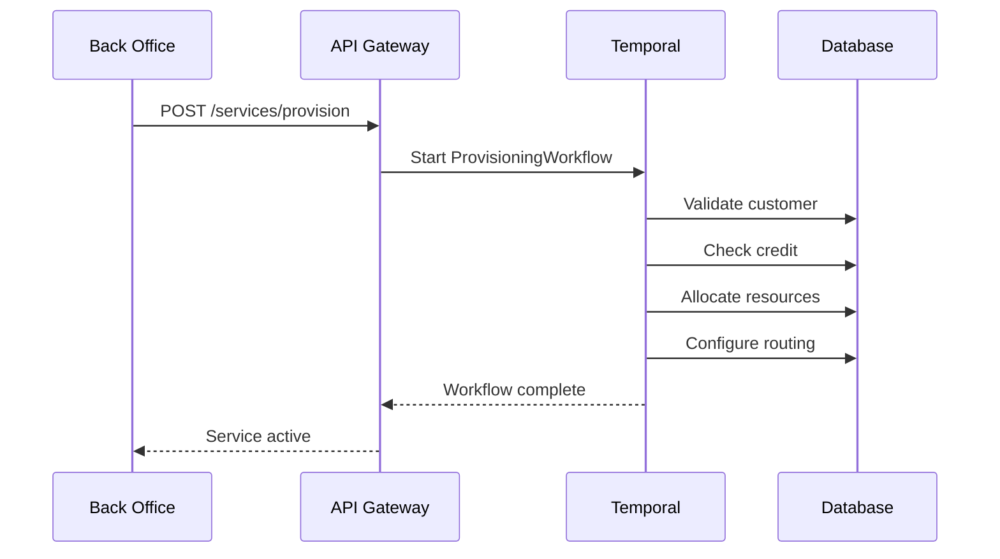

# Back Office Engineer Training Manual

> **Role**: Back Office Engineer  
> **Platform**: Unified Brivas Platform  
> **Version**: 1.0.0 | January 2026

---

## 1. Role Overview

### 1.1 Responsibilities

As a Back Office Engineer, you handle:
- Customer account management
- Service provisioning & configuration
- Rate plan setup & maintenance
- Ticket resolution (Tier 2)
- Reporting & reconciliation

### 1.2 Systems Access

| System | Purpose | URL |
|--------|---------|-----|
| Admin Portal | Customer/service management | `http://admin.brivas.io` |
| QuestDB | CDR queries | `http://localhost:9000` |
| Grafana | Dashboards | `http://localhost:3000` |
| Jira | Tickets | `https://jira.brivas.io` |

---

## 2. Customer Management

### 2.1 Creating a New Customer

**Via Admin Portal:**
1. Navigate to Customers → Add New
2. Fill in company details
3. Upload KYC documents
4. Set credit limit
5. Submit for approval

**Via API:**
```bash
curl -X POST http://localhost:8080/api/v1/customers \
  -H "Authorization: Bearer $TOKEN" \
  -d '{
    "company_name": "Acme Corp",
    "contact_email": "admin@acme.com",
    "contact_phone": "+2348012345678",
    "address": "123 Main St, Lagos",
    "credit_limit": 10000,
    "billing_currency": "USD"
  }'
```

### 2.2 Customer Status

| Status | Meaning | Actions |
|--------|---------|---------|
| `pending` | Awaiting KYC approval | Review docs |
| `active` | Fully operational | Normal |
| `suspended` | Account on hold | Contact finance |
| `terminated` | Permanently closed | None |

---

## 3. Service Provisioning

### 3.1 Enabling Voice Service

```bash
curl -X POST http://localhost:8080/api/v1/services/provision \
  -H "Authorization: Bearer $TOKEN" \
  -d '{
    "customer_id": "uuid",
    "service_type": "voice_termination",
    "rate_plan_id": "uuid",
    "max_channels": 50,
    "allowed_destinations": ["234", "1"],
    "cli_rules": {
      "allow_custom_cli": true,
      "validate_cli": true
    }
  }'
```

### 3.2 Provisioning Workflow



### 3.3 Common Provisioning Tasks

| Task | API Endpoint | Notes |
|------|--------------|-------|
| Add DID | `POST /dids/allocate` | Check inventory |
| Add SIP trunk | `POST /trunks` | Requires IP whitelist |
| Change rate plan | `PATCH /services/{id}` | Effective next billing |
| Increase channels | `PATCH /services/{id}` | May need approval |

---

## 4. Rate Plan Management

### 4.1 Creating a Rate Plan

```bash
curl -X POST http://localhost:8080/api/v1/rate-plans \
  -d '{
    "name": "Standard International",
    "currency": "USD",
    "billing_increment": 6,
    "minimum_duration": 6,
    "rates": [
      {"prefix": "1", "rate": 0.015, "description": "USA"},
      {"prefix": "44", "rate": 0.02, "description": "UK"},
      {"prefix": "234", "rate": 0.025, "description": "Nigeria"}
    ]
  }'
```

### 4.2 Rate Fields

| Field | Description |
|-------|-------------|
| `prefix` | Destination prefix (e.g., "234" for Nigeria) |
| `rate` | Per-minute rate in plan currency |
| `billing_increment` | Rounding (6 = 6-second increments) |
| `minimum_duration` | Minimum billable duration |
| `effective_date` | When rate becomes active |

### 4.3 Bulk Rate Upload

```bash
# CSV format: prefix,rate,description
curl -X POST http://localhost:8080/api/v1/rate-plans/{id}/import \
  -F "file=@rates.csv"
```

---

## 5. Troubleshooting

### 5.1 "Calls Not Completing"

**Step 1: Check customer status**
```sql
SELECT id, status, credit_balance, credit_limit
FROM customers WHERE id = '{customer_id}';
```

**Step 2: Check recent CDRs**
```sql
SELECT timestamp, destination_number, disposition, hangup_cause
FROM cdr
WHERE customer_id = '{customer_id}'
ORDER BY timestamp DESC
LIMIT 20;
```

**Step 3: Common causes**
| Disposition | Cause | Action |
|-------------|-------|--------|
| `no_credit` | Insufficient balance | Top up or increase limit |
| `no_route` | Missing route | Check rate plan |
| `carrier_reject` | Carrier issue | Try another carrier |
| `invalid_number` | Wrong format | Check number format |

### 5.2 "High Failure Rate"

```sql
-- Find problematic routes
SELECT 
    substring(destination_number, 1, 5) as prefix,
    count(*) as total,
    sum(case when disposition='answered' then 1 else 0 end) as answered,
    sum(case when disposition='answered' then 1.0 else 0.0 end)/count(*)*100 as asr
FROM cdr
WHERE customer_id = '{customer_id}'
  AND timestamp > dateadd('d', -1, now())
GROUP BY prefix
HAVING asr < 40
ORDER BY total DESC;
```

### 5.3 Quick Fix Commands

```bash
# Reactivate suspended service
curl -X PATCH http://localhost:8080/api/v1/services/{id} \
  -d '{"status": "active"}'

# Force route refresh
curl -X POST http://localhost:8095/api/v1/lcr/refresh

# Clear carrier cache
curl -X DELETE http://localhost:8095/api/v1/cache/carriers
```

---

## 6. Reporting

### 6.1 Customer Usage Report

```sql
SELECT 
    date_trunc('day', timestamp) as date,
    count(*) as calls,
    sum(duration_secs)/60.0 as minutes,
    sum(revenue) as billed_amount
FROM cdr
WHERE customer_id = '{customer_id}'
  AND timestamp >= '2026-01-01'
  AND timestamp < '2026-02-01'
GROUP BY date_trunc('day', timestamp)
ORDER BY date;
```

### 6.2 Prepaid Balance Check

```sql
SELECT 
    id,
    company_name,
    credit_balance,
    credit_limit,
    (select sum(cost) from cdr 
     where customer_id = c.id 
     and timestamp > dateadd('d', -1, now())) as last_24h_usage
FROM customers c
WHERE status = 'active'
ORDER BY credit_balance ASC
LIMIT 20;
```

---

## 7. Escalation Matrix

| Issue Type | Tier 1 | Tier 2 | Tier 3 |
|------------|--------|--------|--------|
| Billing question | Support | Back Office | Finance |
| Call quality | Support | NOC | Engineering |
| Feature request | Support | Back Office | Product |
| Security concern | Support | Security | CISO |

---

## 8. Daily Checklist

- [ ] Review pending provisioning requests
- [ ] Check low-balance customer alerts
- [ ] Process rate plan change requests
- [ ] Review Tier 2 tickets
- [ ] Update customer documentation
- [ ] End-of-day reconciliation

---

## 9. Quick Reference

### Useful Queries

```sql
-- Find customer by phone/email
SELECT * FROM customers 
WHERE contact_email LIKE '%example.com%'
   OR contact_phone LIKE '%234801%';

-- Customer's current services
SELECT s.*, r.name as rate_plan
FROM services s
JOIN rate_plans r ON s.rate_plan_id = r.id
WHERE s.customer_id = '{customer_id}';

-- Recent usage summary
SELECT 
    sum(duration_secs)/60 as minutes,
    sum(cost) as cost,
    sum(revenue) as revenue
FROM cdr
WHERE customer_id = '{customer_id}'
  AND timestamp > dateadd('d', -7, now());
```

### Common API Endpoints

| Action | Method | Endpoint |
|--------|--------|----------|
| List customers | GET | `/api/v1/customers` |
| Get customer | GET | `/api/v1/customers/{id}` |
| Update customer | PATCH | `/api/v1/customers/{id}` |
| List services | GET | `/api/v1/services?customer_id=` |
| Provision service | POST | `/api/v1/services/provision` |
| List rate plans | GET | `/api/v1/rate-plans` |
| Customer CDRs | GET | `/api/v1/customers/{id}/cdrs` |
