# Business Development Training Manual

> **Role**: Business Development  
> **Platform**: Unified Brivas Platform  
> **Version**: 1.0.0 | January 2026

---

## 1. Platform Overview

### 1.1 What We Offer

The Unified Brivas Platform is a **carrier-grade telecommunications platform** providing:

| Service | Description | Target Market |
|---------|-------------|---------------|
| **Voice Termination** | International/domestic call routing | Carriers, MVNOs |
| **SMS Gateway** | A2P and P2P messaging | Enterprises, Aggregators |
| **USSD Gateway** | Mobile money, banking codes | Fintechs, Banks |
| **RCS Messaging** | Rich Business Messaging | Brands, Enterprises |
| **Flash Call** | Phone verification | Auth providers |
| **SIP Trunking** | Enterprise voice | Call centers, SMBs |

### 1.2 Key Differentiators

```mermaid
graph LR
    A["🚀 Performance"] -->|"10M+ TPS"| B["Industry Best"]
    C["💰 Cost"] -->|"30-50% lower"| D["Direct Routes"]
    E["🔒 Security"] -->|"STIR/SHAKEN"| F["Fraud Prevention"]
    G["📊 Analytics"] -->|"Real-time"| H["QuestDB/ClickHouse"]
```



| Feature | Our Platform | Competitors |
|---------|--------------|-------------|
| Latency | <1ms p99 | 10-50ms |
| Throughput | 10M+ TPS | 100K-1M |
| Analytics | Real-time (sub-2ms) | Batch (hours) |
| Fraud Detection | ML-powered, real-time | Rule-based, delayed |
| Uptime SLA | 99.99% | 99.9% |

---

## 2. Products & Pricing

### 2.1 Voice Termination

**Rate Tiers:**
| Tier | Volume (minutes/month) | Discount |
|------|------------------------|----------|
| Starter | <100K | Base rate |
| Growth | 100K - 1M | 10% off |
| Enterprise | 1M - 10M | 20% off |
| Carrier | 10M+ | Custom |

**Key Features:**
- 200+ direct carrier interconnects
- Intelligent LCR (5 routing modes)
- Quality-based routing option
- Real-time CDR access

### 2.2 SMS Gateway

**Pricing Model:**
| Region | MT Rate | MO Rate |
|--------|---------|---------|
| Nigeria | $0.008 | $0.002 |
| Kenya | $0.012 | $0.003 |
| South Africa | $0.015 | $0.004 |
| USA | $0.006 | $0.001 |
| International | $0.02-0.08 | Varies |

**Features:**
- Sender ID registration
- SMPP/HTTP API
- Delivery reports
- Unicode support

### 2.3 USSD Gateway

**Use Cases:**
- Mobile money
- Banking USSD codes
- Surveys & voting
- Customer service

**Pricing:** Custom based on volume and session length

---

## 3. Technical Capabilities

### 3.1 Architecture Highlights

For technical discussions with prospects:

```
┌─────────────────────────────────────────────────────────────┐
│                    UNIFIED BRIVAS PLATFORM                   │
├─────────────────────────────────────────────────────────────┤
│  Edge Layer     │ XDP/eBPF Load Balancer (100+ Gbps)        │
│  API Layer      │ REST, GraphQL, WebSocket, SMPP, SIP       │
│  Voice          │ Class 4/5 Softswitch (Kamailio/OpenSIPS)  │
│  Messaging      │ SMSC, USSD, RCS, IM                       │
│  Workflows      │ Temporal (Netflix/Uber scale)             │
│  Analytics      │ QuestDB (11.4M rows/sec)                  │
│  Data           │ LumaDB, ClickHouse, Redpanda              │
└─────────────────────────────────────────────────────────────┘
```

### 3.2 Integration Options

| Method | Use Case | Complexity |
|--------|----------|------------|
| REST API | Quick start, low volume | Low |
| GraphQL | Flexible queries | Medium |
| SMPP | High-volume SMS | Medium |
| SIP Trunk | Voice termination | Medium |
| WebSocket | Real-time events | Low |

---

## 4. Sales Talking Points

### 4.1 Value Propositions by Segment

**For Carriers/MVNOs:**
- "Reduce termination costs by 30% with our direct routes"
- "Real-time analytics - see your traffic stats instantly"
- "99.99% uptime SLA with automatic failover"

**For Enterprises:**
- "Unified API for voice, SMS, and USSD"
- "Developer-friendly with SDKs in all languages"
- "Pay only for what you use - no minimums"

**For Fintechs:**
- "Sub-second SMS delivery for OTPs"
- "STIR/SHAKEN for flash call verification"
- "PCI-DSS compliant infrastructure"

### 4.2 Competitive Responses

**"We already use Twilio":**
- "Our rates are 30-50% lower for African routes"
- "Local presence means better latency"
- "Direct routes = better delivery rates"

**"We need enterprise SLA":**
- "99.99% uptime with financial guarantees"
- "24/7 NOC with 15-minute response time"
- "Dedicated account manager included"

**"Security concerns":**
- "STIR/SHAKEN enabled for call authentication"
- "Real-time fraud detection with ML"
- "ISO 27001 compliant data centers"

---

## 5. Demo Script

### 5.1 Platform Demo (15 min)

**Setup:**
```bash
# Ensure demo environment is running
curl http://demo.brivas.io/health
```

**Demo Flow:**

1. **Dashboard Overview** (2 min)
   - Show Grafana real-time dashboard
   - Highlight CPS, ASR, active calls

2. **Send Test SMS** (3 min)
   ```bash
   curl -X POST https://demo.brivas.io/api/v1/sms/send \
     -H "Authorization: Bearer $DEMO_TOKEN" \
     -d '{"to": "+2348012345678", "message": "Hello from Brivas!"}'
   ```
   - Show delivery report

3. **Voice Route Lookup** (3 min)
   ```bash
   curl https://demo.brivas.io/api/v1/lcr/route?destination=+14155551234
   ```
   - Explain LCR logic

4. **Analytics** (5 min)
   - Open QuestDB console
   - Run traffic query
   - Show real-time ingestion

5. **Wrap-up** (2 min)
   - Pricing discussion
   - Next steps

---

## 6. Onboarding Process

### 6.1 New Customer Checklist

1. **Agreement** - Sign MSA + Service Agreement
2. **KYC** - Business registration, ID verification
3. **Technical** - API credentials, IP whitelist
4. **Testing** - Sandbox environment access
5. **Funding** - Initial deposit or credit line
6. **Go-Live** - Production access

### 6.2 Time to Live

| Step | Duration |
|------|----------|
| Paperwork | 1-2 days |
| Technical setup | 1 day |
| Testing | 1-3 days |
| **Total** | **3-6 days** |

---

## 7. Support Resources

### 7.1 Documentation

| Resource | URL |
|----------|-----|
| API Docs | https://docs.brivas.io/api |
| SDKs | https://github.com/brivas |
| Status Page | https://status.brivas.io |

### 7.2 Contacts

| Team | Purpose | Contact |
|------|---------|---------|
| Sales | Pricing, contracts | sales@brivas.io |
| Support | Technical issues | support@brivas.io |
| NOC | Emergencies | +234-XXX-XXXX (24/7) |

---

## 8. Quick Win Scenarios

### 8.1 Migration from Competitor

**Pitch:** "We can migrate you in 48 hours with zero downtime"

**Process:**
1. Shadow routing (parallel testing)
2. Gradual traffic shift (10% → 50% → 100%)
3. Full cutover with rollback option

### 8.2 Cost Optimization

**Pitch:** "Let us analyze your current spend and show savings"

**Deliverable:**
- Rate comparison by destination
- Volume-based discount proposal
- Quality comparison (ASR/PDD)

---

## 9. FAQ

**Q: What's your uptime guarantee?**
A: 99.99% with financial credits for any downtime.

**Q: Do you support number porting?**
A: Yes, we handle LNP coordination.

**Q: What about regulatory compliance?**
A: We're compliant with NCC, ICASA, and FCC regulations.

**Q: Can we get a POC?**
A: Yes, we offer a 14-day trial with full features.

**Q: What's your billing cycle?**
A: Real-time rating, monthly invoicing, NET-30 terms.
