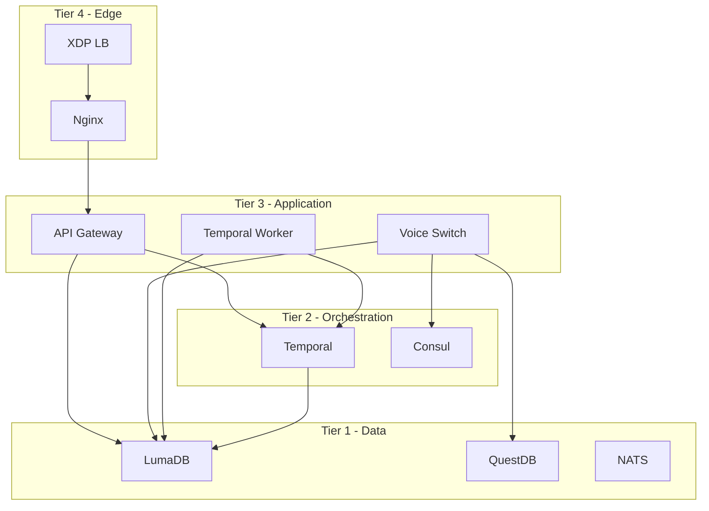

# DevOps Engineer Training Manual

> **Role**: DevOps Engineer  
> **Platform**: Unified Brivas Platform  
> **Version**: 1.0.0 | January 2026

---

## 1. Introduction

### 1.1 Role Overview
As a DevOps Engineer, you are responsible for:
- Infrastructure provisioning and management
- CI/CD pipeline maintenance
- Container orchestration (Kubernetes/Docker)
- Service mesh and observability
- Disaster recovery and backup
- Performance optimization

### 1.2 Technology Stack Overview

| Layer | Technology | Your Responsibility |
|-------|------------|---------------------|
| Orchestration | Kubernetes/Docker | Cluster management |
| Service Mesh | Consul, NATS | Service discovery |
| CI/CD | GitHub Actions | Pipeline maintenance |
| Observability | Grafana, Jaeger | Monitoring setup |
| Infrastructure | XDP/eBPF | Network optimization |

---

## 2. Infrastructure Setup

### 2.1 Local Development Environment

```bash
# Clone repository
git clone https://github.com/billyronks/Project-Catalyst-Merged
cd Project-Catalyst-Merged/unified-brivas-platform

# Copy environment template
cp .env.example .env

# Start core services
docker-compose up -d lumadb nats questdb

# Start application services
docker-compose up -d api-gateway voice-switch temporal

# Start with analytics profile
docker-compose --profile analytics up -d

# Start with service mesh
docker-compose --profile mesh up -d
```

### 2.2 Docker Compose Profiles

| Profile | Services Included | Use Case |
|---------|------------------|----------|
| (default) | Core services | Development |
| `analytics` | QuestDB, ClickHouse | Full analytics |
| `streaming` | Redpanda | Kafka workloads |
| `mesh` | Consul | Service discovery |
| `signaling` | Kamailio, OpenSIPS, FreeSWITCH | Voice testing |

```bash
# Multiple profiles
docker-compose --profile analytics --profile mesh up -d
```

### 2.3 Kubernetes Deployment

```bash
# Apply namespaces
kubectl apply -f k8s/namespaces.yaml

# Deploy data layer
kubectl apply -f k8s/data/

# Deploy core services
kubectl apply -f k8s/core/

# Deploy telecom services
kubectl apply -f k8s/telecom/

# Verify deployment
kubectl get pods -n brivas-core
```

---

## 3. Service Architecture

### 3.1 Service Dependencies



### 3.2 Startup Order

```yaml
# docker-compose.yml order
1. lumadb         # Database first
2. nats           # Messaging
3. questdb        # Analytics
4. consul         # Discovery (if mesh profile)
5. temporal       # Workflow engine
6. temporal-ui    # Workflow UI
7. api-gateway    # API layer
8. voice-switch   # Voice services
9. temporal-worker # Workflow executor
10. nginx         # Reverse proxy
```

---

## 4. CI/CD Pipeline

### 4.1 GitHub Actions Workflow

```yaml
# .github/workflows/ci.yml
name: CI

on:
  push:
    branches: [main, develop]
  pull_request:
    branches: [main]

jobs:
  test:
    runs-on: ubuntu-latest
    steps:
      - uses: actions/checkout@v4
      
      - name: Install Rust
        uses: dtolnay/rust-action@stable
        
      - name: Run tests
        run: cargo test --workspace
        
      - name: Security audit
        run: cargo audit
        
  build:
    needs: test
    runs-on: ubuntu-latest
    steps:
      - name: Build Docker images
        run: docker-compose build
        
      - name: Push to registry
        run: |
          docker tag brivas-voice-switch:latest $REGISTRY/voice-switch:$SHA
          docker push $REGISTRY/voice-switch:$SHA
```

### 4.2 Build Commands

```bash
# Build all images
docker-compose build

# Build specific service
docker-compose build voice-switch

# Build with no cache
docker-compose build --no-cache voice-switch

# Rust release build
cargo build --release --package voice-switch
```

---

## 5. Monitoring & Observability

### 5.1 Prometheus Metrics

All Rust services expose metrics at `/metrics`:

```bash
curl http://localhost:8095/metrics
```

**Key Metrics:**
```
# HELP http_requests_total Total HTTP requests
http_requests_total{method="GET",path="/health"} 1234

# HELP call_duration_seconds Call duration histogram
call_duration_seconds_bucket{le="60"} 500
call_duration_seconds_bucket{le="120"} 800

# HELP active_calls Current active calls
active_calls 42
```

### 5.2 Grafana Configuration

**Datasources:**
```yaml
# grafana/provisioning/datasources/default.yaml
datasources:
  - name: Prometheus
    type: prometheus
    url: http://prometheus:9090
    
  - name: QuestDB
    type: postgres
    url: questdb:8812
    database: qdb
    
  - name: Jaeger
    type: jaeger
    url: http://jaeger:16686
```

### 5.3 Distributed Tracing

```rust
// Tracing is auto-instrumented via brivas-telemetry
// Traces flow: API Gateway → Voice Switch → LumaDB
```

**View traces:**
- Jaeger UI: `http://localhost:16686`
- Filter by service: `voice-switch`

---

## 6. Scaling & Performance

### 6.1 Horizontal Scaling

```bash
# Docker Compose scaling
docker-compose up -d --scale voice-switch=3

# Kubernetes scaling
kubectl scale deployment voice-switch --replicas=5 -n brivas-core
```

### 6.2 Resource Limits

```yaml
# Recommended limits per service
voice-switch:
  resources:
    limits:
      cpu: "2"
      memory: "2Gi"
    requests:
      cpu: "500m"
      memory: "512Mi"

questdb:
  resources:
    limits:
      cpu: "4"
      memory: "4Gi"
```

### 6.3 Performance Tuning

**System Tuning:**
```bash
# Increase file descriptors
echo "* soft nofile 65535" >> /etc/security/limits.conf
echo "* hard nofile 65535" >> /etc/security/limits.conf

# Network tuning for XDP
sysctl -w net.core.rmem_max=134217728
sysctl -w net.core.wmem_max=134217728
sysctl -w net.core.netdev_max_backlog=5000
```

---

## 7. Backup & Recovery

### 7.1 Database Backup

```bash
# LumaDB backup
pg_dump -h localhost -U brivas -d brivas > backup_$(date +%Y%m%d).sql

# QuestDB backup
curl -X POST "http://localhost:9000/exec?query=SNAPSHOT+DATABASE"
```

### 7.2 Disaster Recovery

**RTO/RPO Targets:**
| Component | RPO | RTO |
|-----------|-----|-----|
| LumaDB | 5 min | 15 min |
| QuestDB | 1 hour | 30 min |
| Configuration | Real-time | 5 min |

**Recovery Steps:**
1. Deploy infrastructure from Git
2. Restore LumaDB from backup
3. Restore QuestDB from snapshot
4. Verify service health
5. Validate routing

---

## 8. Security

### 8.1 Secrets Management

```bash
# .env file (never commit!)
LUMADB_PASSWORD=change_me_in_production
QUESTDB_PASSWORD=change_me_in_production
JWT_SECRET=generate_with_openssl_rand

# Kubernetes secrets
kubectl create secret generic brivas-secrets \
  --from-literal=lumadb-password=$DB_PASS \
  --from-literal=jwt-secret=$JWT_SECRET \
  -n brivas-core
```

### 8.2 Network Policies

```yaml
# k8s/network-policy.yaml
apiVersion: networking.k8s.io/v1
kind: NetworkPolicy
metadata:
  name: voice-switch-policy
spec:
  podSelector:
    matchLabels:
      app: voice-switch
  ingress:
    - from:
        - podSelector:
            matchLabels:
              app: api-gateway
      ports:
        - port: 8095
```

### 8.3 Security Scan

```bash
# Rust dependencies
cargo audit

# Docker images
trivy image brivas-voice-switch:latest

# Kubernetes
kubesec scan k8s/core/voice-switch.yaml
```

---

## 9. Troubleshooting

### 9.1 Common Issues

**Service won't start:**
```bash
# Check logs
docker-compose logs voice-switch

# Common causes:
# - Port already in use
# - Database not ready
# - Missing environment variables
```

**High memory usage:**
```bash
# Check container stats
docker stats

# Profile Rust memory
MALLOC_CONF=prof:true ./voice-switch
```

**Network issues:**
```bash
# Test connectivity
docker exec brivas-voice-switch ping lumadb

# Check DNS
docker exec brivas-voice-switch nslookup questdb
```

### 9.2 Debug Mode

```bash
# Enable verbose logging
RUST_LOG=debug docker-compose up voice-switch

# Trace all SQL queries
RUST_LOG=sqlx=trace docker-compose up voice-switch
```

---

## 10. Runbooks

### 10.1 Deploying a New Version

```bash
# 1. Pull latest code
git pull origin main

# 2. Build new images
docker-compose build

# 3. Rolling update
docker-compose up -d --no-deps voice-switch

# 4. Verify health
curl http://localhost:8095/health

# 5. Monitor for 10 minutes
```

### 10.2 Rollback Procedure

```bash
# Docker Compose
docker-compose stop voice-switch
docker tag brivas-voice-switch:previous brivas-voice-switch:latest
docker-compose up -d voice-switch

# Kubernetes
kubectl rollout undo deployment/voice-switch -n brivas-core
```

### 10.3 Emergency Maintenance

```bash
# 1. Enable maintenance mode
curl -X POST http://localhost:8080/admin/maintenance

# 2. Drain traffic (wait 60s)
sleep 60

# 3. Perform maintenance
# ...

# 4. Disable maintenance mode
curl -X DELETE http://localhost:8080/admin/maintenance
```

---

## 11. Certification Checklist

Complete these tasks to be certified:

- [ ] Deploy full stack locally with docker-compose
- [ ] Scale voice-switch to 3 replicas
- [ ] Set up Prometheus + Grafana monitoring
- [ ] Create a backup of LumaDB
- [ ] Perform a rollback drill
- [ ] Run security scan on all images
- [ ] Document a runbook for a new scenario
