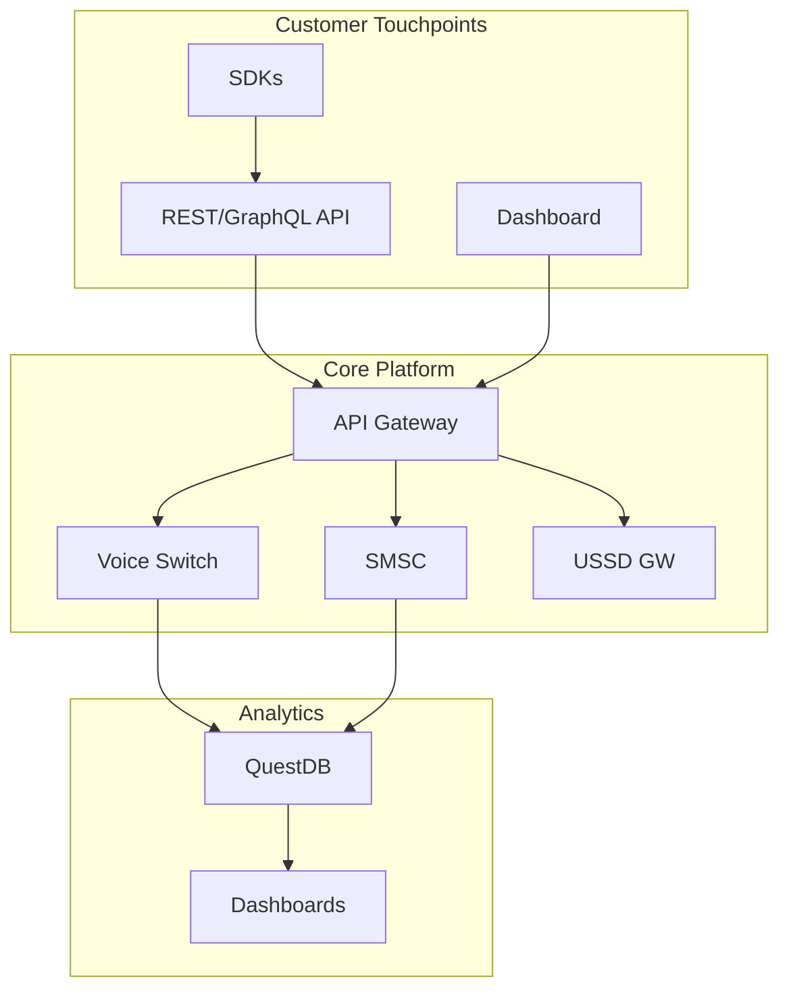
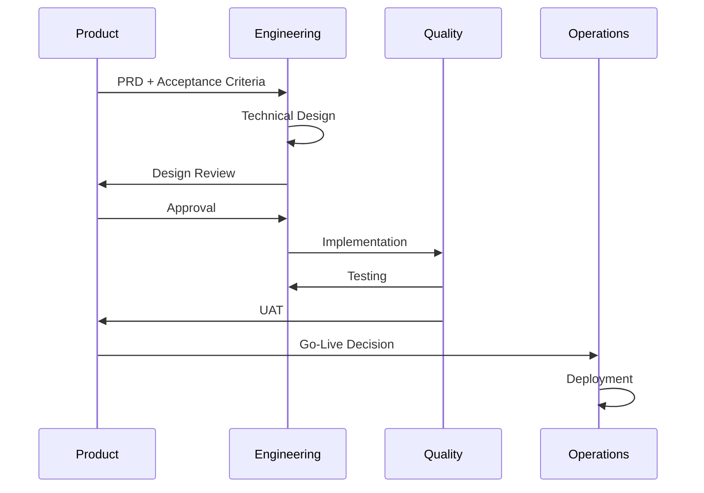

# Product Engineer Training Manual

> **Role**: Product Engineer  
> **Platform**: Unified Brivas Platform  
> **Version**: 1.0.0 | January 2026

---

## 1. Platform Product Overview

### 1.1 Product Portfolio

| Product | Status | Revenue | Priority |
|---------|--------|---------|----------|
| Voice Termination | GA | 45% | P0 |
| SMS Gateway | GA | 30% | P0 |
| USSD Gateway | GA | 15% | P1 |
| Flash Call (OTP) | GA | 8% | P1 |
| RCS Messaging | Beta | 2% | P2 |
| WebRTC | Alpha | - | P3 |

### 1.2 Architecture for Product Decisions



---

## 2. Feature Development Lifecycle

### 2.1 Process



### 2.2 PRD Template

```markdown
# Feature: [Name]

## Problem Statement
What problem are we solving?

## Success Metrics
- Metric 1: Target
- Metric 2: Target

## User Stories
- As a [user], I want [feature] so that [benefit]

## Acceptance Criteria
- [ ] Criterion 1
- [ ] Criterion 2

## Technical Considerations
- Dependencies
- Risks
- Scalability

## Timeline
- Design: X days
- Development: Y days
- Testing: Z days
```

---

## 3. API Design Principles

### 3.1 Consistency

All APIs follow these conventions:

| Aspect | Standard |
|--------|----------|
| Versioning | URL path (`/api/v1/`) |
| Auth | Bearer token |
| Errors | `{"error": {"code": "", "message": ""}}` |
| Pagination | `?limit=50&offset=0` |
| Filtering | `?status=active&created_after=2026-01-01` |

### 3.2 Example: Designing a New Endpoint

**Good:**
```
POST /api/v1/voice/calls
GET  /api/v1/voice/calls/{id}
GET  /api/v1/voice/calls?status=active
```

**Bad:**
```
POST /api/v1/makeCall
GET  /api/v1/getCallById/{id}
GET  /api/v1/searchCalls
```

---

## 4. Analytics for Product

### 4.1 Key Product Metrics

| Metric | Definition | Dashboard |
|--------|------------|-----------|
| MAU | Monthly Active Users | Growth |
| API Calls | Total API requests | Usage |
| Error Rate | 4xx + 5xx / Total | Quality |
| Latency p99 | 99th percentile | Performance |
| Revenue/User | Total Rev / Active Users | Monetization |

### 4.2 Querying Product Metrics

```sql
-- Daily Active Users
SELECT 
    date_trunc('day', timestamp) as date,
    count(DISTINCT customer_id) as dau
FROM api_requests
WHERE timestamp > dateadd('d', -30, now())
GROUP BY date_trunc('day', timestamp)
ORDER BY date;

-- Feature Adoption
SELECT 
    endpoint,
    count(*) as requests,
    count(DISTINCT customer_id) as unique_users
FROM api_requests
WHERE timestamp > dateadd('d', -7, now())
GROUP BY endpoint
ORDER BY requests DESC;

-- Error Analysis
SELECT 
    endpoint,
    status_code,
    count(*) as occurrences
FROM api_requests
WHERE status_code >= 400
  AND timestamp > dateadd('d', -1, now())
GROUP BY endpoint, status_code
ORDER BY occurrences DESC;
```

---

## 5. Customer Feedback Loop

### 5.1 Feedback Sources

| Source | Frequency | Owner |
|--------|-----------|-------|
| Support Tickets | Daily | Support |
| NPS Survey | Monthly | Product |
| Customer Calls | Weekly | BD + Product |
| Usage Analytics | Real-time | Product |

### 5.2 Prioritization Framework

| Factor | Weight |
|--------|--------|
| Revenue Impact | 30% |
| Customer Requests | 25% |
| Strategic Alignment | 25% |
| Engineering Effort | 20% |

---

## 6. A/B Testing

### 6.1 Feature Flags

```bash
# Enable feature for 10% of users
curl -X POST http://localhost:8080/api/v1/features \
  -d '{
    "name": "new_lcr_algorithm",
    "enabled": true,
    "rollout_percentage": 10
  }'
```

### 6.2 Measuring Impact

```sql
-- Compare metrics between control and treatment
SELECT 
    feature_variant,
    count(*) as requests,
    avg(latency_ms) as avg_latency,
    sum(case when status_code = 200 then 1 else 0 end)::float / count(*) as success_rate
FROM api_requests
WHERE feature_name = 'new_lcr_algorithm'
  AND timestamp > dateadd('d', -7, now())
GROUP BY feature_variant;
```

---

## 7. Competitive Analysis

### 7.1 Feature Comparison

| Feature | Brivas | Competitor A | Competitor B |
|---------|--------|--------------|--------------|
| Real-time analytics | ✅ | ❌ | ✅ |
| ML fraud detection | ✅ | ❌ | ❌ |
| STIR/SHAKEN | ✅ | ✅ | ❌ |
| WebRTC | 🔄 | ✅ | ❌ |
| GraphQL API | ✅ | ❌ | ❌ |

### 7.2 Gap Analysis Template

```
Feature: [Name]
Gap Type: [Missing / Partial / Outdated]
Customer Impact: [High / Medium / Low]
Competitive Risk: [High / Medium / Low]
Effort to Close: [S / M / L / XL]
Recommendation: [Build / Buy / Partner / Ignore]
```

---

## 8. Roadmap Communication

### 8.1 Internal Roadmap

| Quarter | Theme | Key Deliverables |
|---------|-------|------------------|
| Q1 2026 | Scale | QuestDB migration, XDP LB |
| Q2 2026 | Features | WebRTC GA, RCS enhancements |
| Q3 2026 | AI | Fraud ML v2, Call analytics |
| Q4 2026 | Enterprise | Multi-tenant, SSO |

### 8.2 External Communication

- **What to share**: Themes, timelines
- **What NOT to share**: Specific features, dates
- **Format**: Quarterly customer newsletter

---

## 9. Product Metrics Dashboard

Access: `http://localhost:3000/d/product-overview`

**Panels:**
1. Daily/Weekly/Monthly Active Users
2. API Request Volume by Endpoint
3. Error Rate Trends
4. Revenue by Product
5. Customer Health Scores
6. Feature Adoption Rates
